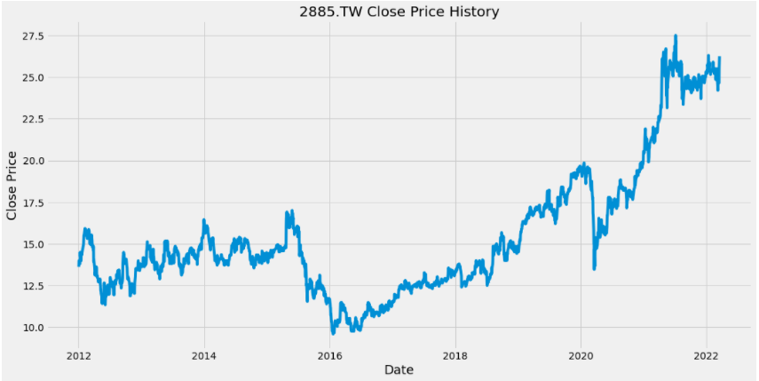
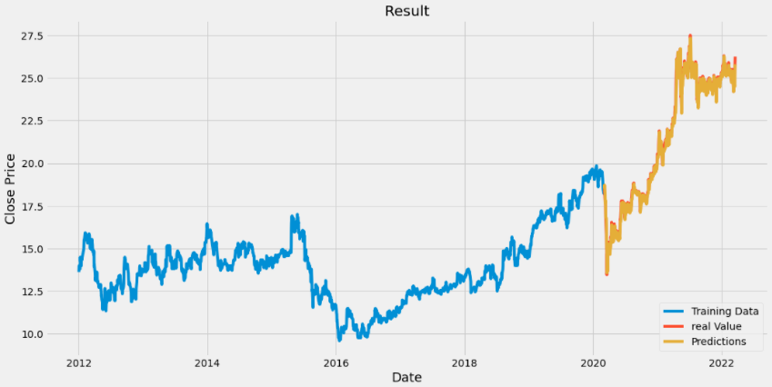
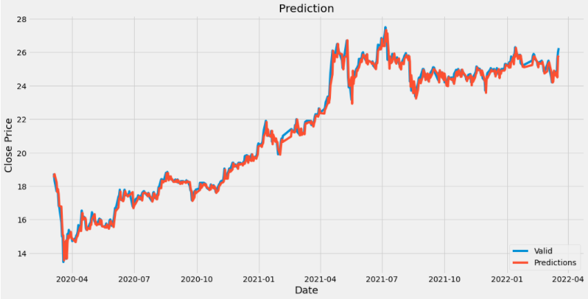
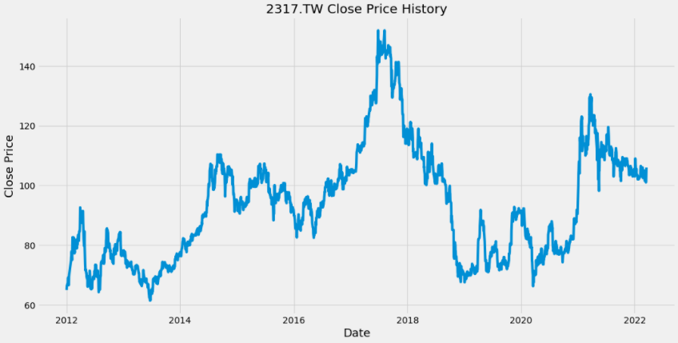
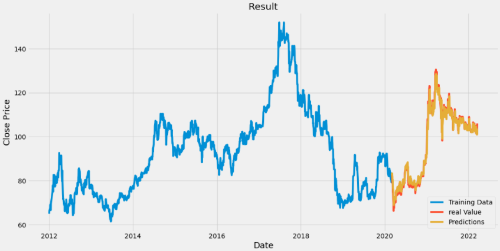
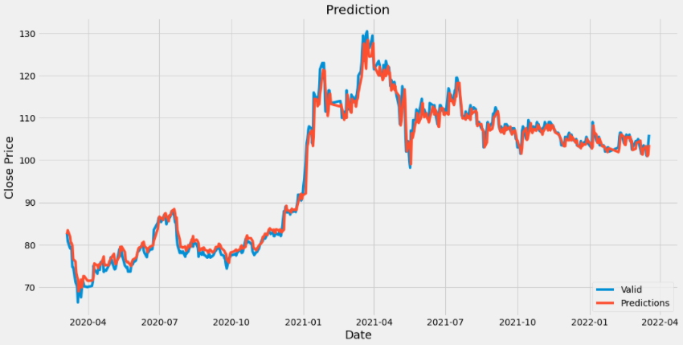

# Stock-Predictor
- This is me trying to use Machine Learning to predict the stock price.
- This is the course project for my Artificial Intelligence &amp; Machine Learning lecture.

## Language & Technology
---
### Python 
In this project, I choose python because panda and numpy will allow me to easily transform stock data to training data set. 
### Keras
Keras is an opensource library, commonly used in Machine Learning to quickly build up neural network, which makes it suitable for this project.

## Results
---
### 2885.TW:
Data set
 
 Training result
 rmse: 0.05139063639813159

 Prediction
 

### 2317.TW:
 Data set
 
 Training result
 rmse: 0.04491196291513711 
 
 Prediction
 